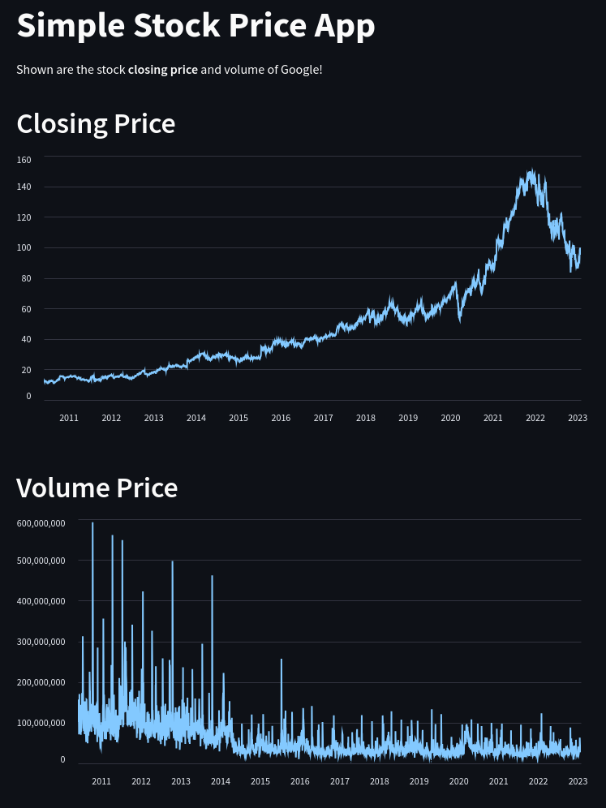

# Simple Stock Price App

This is a simple stock price app that shows the stock closing price and volume of Google.



## Description

This web application fetches and displays the closing price and volume of Google stock using the yfinance library and Streamlit for visualization. It provides an easy-to-use interface for users to track the performance of Google stock over time.

## Installation

To run this application locally, follow these steps:

1. Clone this repository:

    ```
    git clone https://github.com/wolflergf/Stock_Price.git
    ```

2. Navigate to the project directory:

    ```
    cd your_repository
    ```

3. Install the required dependencies:

    ```
    pip install -r requirements.txt
    ```

4. Run the Streamlit app:

    ```
    streamlit run Stock_price.py
    ```

## Usage

Once the Streamlit app is running, open your web browser and navigate to the provided URL. You will see the closing price and volume charts for Google stock. You can interact with the charts by zooming in, panning, and hovering over data points to view detailed information.

## Contributors

- [Wolfler](https://github.com/wolflergf)

## License

This project is licensed under the MIT License - see the [LICENSE](LICENSE) file for details.
